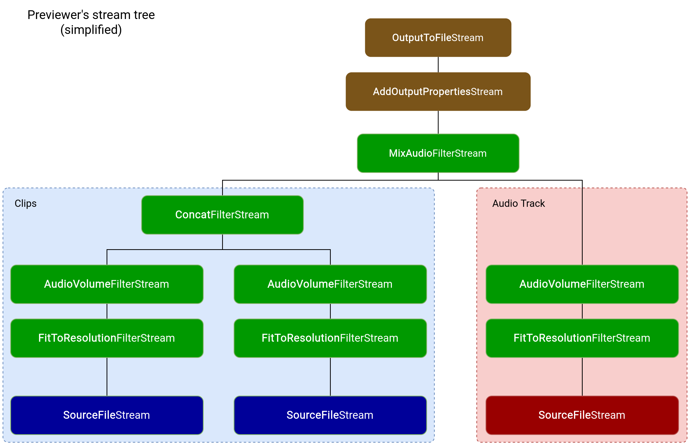

# Picturide

A mobile video editing app that syncronizes transitions/cuts with background tracks' beats. Developed with Flutter and FFMPEG.

## Key Concepts

### Project

A video editing project, that includes several clips and audio tracks. Editable and exportable to a video file.

### Audio Track

A music file with a fixed BPM value. Currently has to start on the first beat of a bar. To work best, should also have a 4/4 or 2/4 time signature.

### Clip

A clip is a portion of a video file that is included in a project. Clips have a duration measured in beats, that translates to a number of seconds depending on the **Audio Track** that is played in the background of the clip. The exported project will be the sequence of its clips, with **Audio Tracks'** sound synced due to the beat-based durations of the clips.

### App Preferences

Holds user preferences and the paths and names of each user-created project.

## Getting Started

This project is a Flutter application.

A few resources to get you started if this is your first Flutter project:

- [Lab: Write your first Flutter app](https://flutter.dev/docs/get-started/codelab)
- [Cookbook: Useful Flutter samples](https://flutter.dev/docs/cookbook)

For help getting started with Flutter, view our
[online documentation](https://flutter.dev/docs), which offers tutorials,
samples, guidance on mobile development, and a full API reference.

## Running

Before running with `flutter run`, please make sure the serializeable models have been generated with `flutter pub run build_runner [watch]`. Otherwise, there will be compilation errors.

## Architecture

The architecture is MVC-based and split into `controller`, `model`, `redux` and `view` folders:
- `controller` contains the most logic intensive tasks, such as: building FFMPEG arguments for previewing and exporting a project; saving and loading projects and app preferences.
- `model` contains the main models covered in the **Key Concepts** section of this readme
- `redux` contains redux-specific models/states, actions and reducers
- `view` contains the UI of the app

## FFMPEG Abstraction

Under the `controller/ffmpeg_build/ffmpeg_abstraction` folder, there are many "stream" classes. These help and abstract ffmpeg arguments creation. For example:

```
OutputToFileStream(
    'output.mp4',
    ConcatenateFilterStream([
        SourceFileStream(FileInput('input1.mp4')),
        SourceFileStream(FileInput('input2.mp4'))
    ])
)
```

will concatenate files `input1.mp4` and `input2.mp4` and output to `output.mp4`.
As a more complex example, here is a simplified diagram for the FFMPEG arguments that allow project preview:

